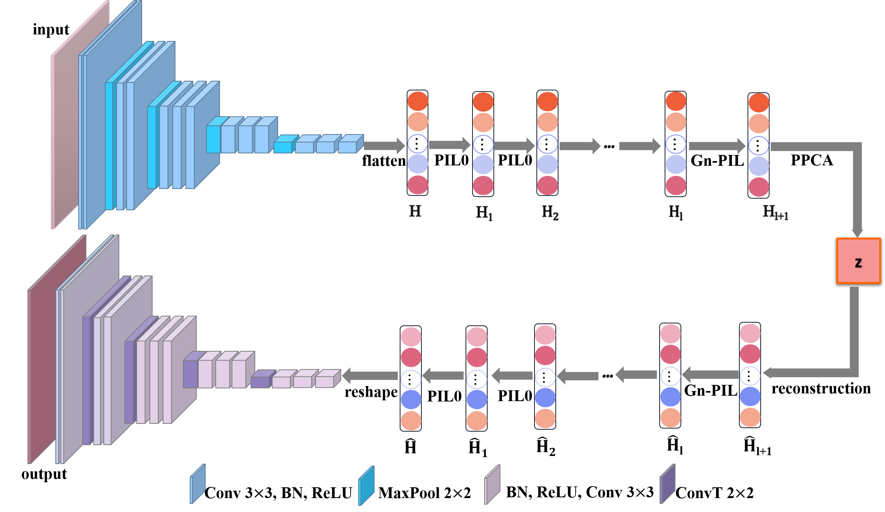

# CPIL-VAE
# Content Generation Model Based on Pseudo-Inverse Collaborative Learning System
This project contains the implementation code of the paper "Content Generation Model Based on Pseudo-Inverse Collaborative Learning System". The provided code is implemented based on Pytorch framework. So that researchers and developers can use it.

## Article Model
You can download the pretrained weights for the autoencoder model from the following link: https://drive.google.com/file/d/1WwJiQ1kBcNCZ37F6PJ_0bIL0ZeU3_sV8/view?usp=drive_link

Make sure to place the downloaded weights in the appropriate directory as specified in the configuration or loading script.


## Requirements
- Linux and Windows are supported.
- 64-bit Python 3.8 and PyTorch 1.10.1.
- CUDA toolkit 11.1 or later. Use at least version 11.1

## Runing the Code
cd pytorch

```python
python CNNPILVAE.py
